<br/>

<div align="center">

</div>

<!-- ══════════════ PROFILE ══════════════ -->
<table width="100%">
<tr>
<td width="30%" valign="top" align="center">


<br/><br/>

**김태현 (TaeHyun Kim)**

[](mailto:kthkmj00@gmail.com)
[](https://github.com/bird8696)

<br/>


</td>
<td width="70%" valign="top">

```yaml
# 🧭 profile.yml

name    : 김태현 (TaeHyun Kim)
role    : Security Engineer (In Training)
school  : 우송대학교 IT융합·컴퓨터정보보안학과
program : SK쉴더스 루키즈 31기

focus:
  primary : Network / Cloud / Application Security
  special : AI-Powered Malware & Log Analysis
            Vulnerability Assessment & Pentesting

certifications:
  - ✅ AWS Cloud Practitioner (CLF-C02)
  - ✅ 정보처리기사 필기
  - ✅ 리눅스 마스터 2급 필기
```

</td>
</tr>
</table>

<br/>

<div align="center">

</div>

<br/>

<!-- ══════════════ ACTIVITY GRAPH ══════════════ -->
<div align="center">

[](https://github.com/bird8696)

</div>

<br/>

<!-- ══════════════ SKILLS ══════════════ -->

$${\color{#7EC8E3}🌊 \space \color{#AEE8F5}Skills}$$

<div align="center">

<table>
<tr>
<td align="center" width="33%">

**💻 Languages**

[](https://skillicons.dev)

</td>
<td align="center" width="33%">

**☁️ Cloud / Infra**

[](https://skillicons.dev)

</td>
<td align="center" width="33%">

**🔐 Security**

[](https://skillicons.dev)

</td>
</tr>
</table>

<br/>


</div>

<br/>

<!-- ══════════════ STATS ══════════════ -->

$${\color{#7EC8E3}📊 \space \color{#AEE8F5}Stats}$$

<div align="center">

<table>
<tr>
<td align="center" width="50%">

[](https://git.io/streak-stats)

</td>
<td align="center" width="50%">

[](https://github.com/vn7n24fzkq/github-profile-summary-cards)

</td>
</tr>
<tr>
<td colspan="2" align="center">

[](https://github.com/vn7n24fzkq/github-profile-summary-cards)

</td>
</tr>
</table>

</div>

<br/>

<!-- ══════════════ PROJECTS ══════════════ -->

$${\color{#7EC8E3}🛠️ \space \color{#AEE8F5}Projects}$$

<table>
<tr>
<td width="50%" valign="top">

$${\color{#5BA4CF}🔐 \space \color{#7EC8E3}AutoGuard \space AI}$$
`팀 프로젝트 · BE Lead`


멀티 에이전트 오케스트레이션 기반 보안 위협 자동 분석 플랫폼. VirusTotal · SafeBrowsing API · GPT-4o-mini RAG 통합.

</td>
<td width="50%" valign="top">

$${\color{#5BA4CF}🛡️ \space \color{#7EC8E3}피싱 \space 이메일 \space 탐지기}$$


Claude AI 기반 Zero-Shot 피싱 탐지 API. 위험도 3단계 분류 `LOW` `MEDIUM` `HIGH` · Swagger UI 제공.

</td>
</tr>
<tr>
<td width="50%" valign="top">

$${\color{#5BA4CF}🤖 \space \color{#7EC8E3}AI \space 보안 \space 위협 \space 탐지 \space 대시보드}$$


[`bird8696/ai-security-dashboard`](https://github.com/bird8696/ai-security-dashboard)

KDD Cup 99 + RandomForest + Claude API 기반 AI 보안 위협 탐지 시스템.

</td>
<td width="50%" valign="top">

$${\color{#5BA4CF}📊 \space \color{#7EC8E3}KTX \space 연착 \space 예측 \space 대시보드}$$


🌐 [`ktx-delay-predictor.streamlit.app`](https://ktx-delay-predictor.streamlit.app)

Korail API + scikit-learn KTX 연착 예측. GitHub Actions 자동 배포.

</td>
</tr>
<tr>
<td width="50%" valign="top">

$${\color{#5BA4CF}🎤 \space \color{#7EC8E3}AI \space 면접 \space 시뮬레이터}$$
`졸업 캡스톤`


GPT-4 · LangChain · Web Speech API · MediaPipe 활용 실시간 AI 면접 평가. **담당: API 연동 및 AI 기능 구현**

</td>
<td width="50%" valign="top">

$${\color{#5BA4CF}🧭 \space \color{#7EC8E3}기타 \space 프로젝트}$$

| 프로젝트 | 기술 |
|----------|------|
| 🎙️ 음성 인식 프로그램 | Python |
| 🤖 Tabi 챗봇 (NLTK) | Python · Tkinter |
| 📱 Short Notes | Java · Android |
| 🎮 Choice Free Game | JavaScript |

</td>
</tr>
</table>

<br/>

<!-- ══════════════ ROADMAP ══════════════ -->

$${\color{#7EC8E3}🗺️ \space \color{#AEE8F5}Roadmap \space \color{#C9F0FF}@ \space SK쉴더스 \space 루키즈 \space 31기}$$

<table align="center" width="80%">
<tr>
<td width="50%" valign="top">

**완료 ✅**

- ✅ Git / Notion 활용법
- ✅ 생성형 AI 활용 파이썬
- ✅ 머신러닝 & 딥러닝
- ✅ 모듈 프로젝트 (1)
- ✅ 네트워크 보안
- ✅ 클라우드 보안
- ✅ 애플리케이션 보안
- ✅ 개인정보보호
- ✅ 모듈 프로젝트 (2)
- ✅ 생성형 AI를 활용한 악성코드 분석 및 대응

</td>
<td width="50%" valign="top">

**진행 중 🌊 / 예정 🔜**

- 🌊 **생성형 AI를 활용한 AI 보안관제 및 통합로그분석** `진행 중`
- 🔜 취약점 진단 및 모의해킹
- 🔜 최종 실무 프로젝트

</td>
</tr>
</table>

<br/>

<!-- ══════════════ FOOTER ══════════════ -->
<div align="center">


<br/><br/>


</div>
