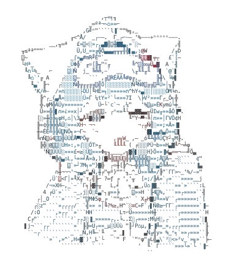

<div align="center">


<br/>


</div>

<br/>

<div align="center">
  
</div>

<br/>

```yaml
$ cat about_me.txt
──────────────────────────────────────────────────────
  생성형 AI를 활용한 사이버보안에 관심이 있습니다.
  Network / Cloud / Application Security를 기반으로,
  AI 기반 악성코드·로그 분석과 모의해킹을 학습하고 있습니다.

  현재  SK쉴더스 루키즈 31기  과정에서
  최종 실무 프로젝트(보안관제)를 진행 중입니다.
──────────────────────────────────────────────────────
```

<div align="center">

**🎓 우송대학교 IT융합·컴퓨터정보보안학과 · SK쉴더스 루키즈 31기**

</div>

<br/>

## `❯` Tech Arsenal

<div align="center">


<br/><br/>


</div>

<br/>

## `❯` Training Log

<table>
<tr><th>기관</th><th>과정</th><th>상태</th></tr>
<tr><td>우송대학교</td><td>IT융합 · 컴퓨터정보보안학과</td><td>✅ 수료</td></tr>
<tr><td>SK쉴더스 루키즈 31기</td><td>생성형 AI 활용 사이버보안 전문인력 양성과정</td><td>🟢 진행 중</td></tr>
<tr><td>2025 기업멤버쉽 아카데미</td><td>SW / 콘텐츠 분야</td><td>✅ 수료</td></tr>
<tr><td>2024 벤처스타트업 아카데미</td><td>SW / 콘텐츠 분야</td><td>✅ 수료</td></tr>
</table>

**Certifications**


<br/>

## `❯` Exploits Deployed

<table>
<tr>
<td width="50%" valign="top">

**🛡️ AutoGuard AI**
`팀 프로젝트 · BE Lead`

멀티 에이전트 오케스트레이션 기반 보안 위협 자동 분석 플랫폼.
VirusTotal · SafeBrowsing API · GPT-4o-mini RAG 통합.


</td>
<td width="50%" valign="top">

**🎣 피싱 이메일 탐지기**

Claude AI 기반 Zero-Shot 피싱 탐지 API.
위험도 3단계 분류(LOW / MEDIUM / HIGH) · Swagger UI 제공.


</td>
</tr>
<tr>
<td width="50%" valign="top">

**🖥️ AI 보안 위협 탐지 대시보드**
[`bird8696/ai-security-dashboard`](https://github.com/bird8696/ai-security-dashboard)

KDD Cup 99 + RandomForest + Claude API 기반
AI 보안 위협 탐지 시스템.


</td>
<td width="50%" valign="top">

**🚄 KTX 연착 예측 대시보드**
[`ktx-delay-predictor.streamlit.app`](https://ktx-delay-predictor.streamlit.app)

Korail API + scikit-learn 기반 KTX 연착 예측.
GitHub Actions 자동 배포.


</td>
</tr>
<tr>
<td width="50%" valign="top">

**🎤 AI 면접 시뮬레이터** `졸업 캡스톤`

GPT-4 · LangChain · Web Speech API · MediaPipe
활용 실시간 AI 면접 평가.
(담당: API 연동 및 AI 기능 구현)


</td>
<td width="50%" valign="top">

</td>
</tr>
</table>

<br/>

## `❯` Mission Roadmap — SK쉴더스 루키즈 31기

-70C5E8?style=for-the-badge&logo=checkmarx&logoColor=0d1117)

- [x] Git / Notion 활용법
- [x] 생성형 AI 활용 파이썬
- [x] 머신러닝 & 딥러닝
- [x] 모듈 프로젝트 (1)
- [x] 네트워크 보안
- [x] 클라우드 보안
- [x] 애플리케이션 보안
- [x] 개인정보보호
- [x] 모듈 프로젝트 (2)
- [x] 생성형 AI를 활용한 악성코드 분석 및 대응
- [x] 생성형 AI를 활용한 AI 보안관제 및 통합 로그 분석
- [x] 생성형 AI를 활용한 취약점 진단 및 모의해킹
- [ ] **최종 실무 프로젝트 (보안관제)** `🟢 진행 중`

<br/>

## `❯` System Metrics

<div align="center">


</div>

<br/>

## `❯` Contribution Grid — Compromised

<div align="center">

<picture>
  <source media="(prefers-color-scheme: dark)" srcset="https://raw.githubusercontent.com/bird8696/bird8696/output/github-contribution-grid-snake-dark.svg" />
  <source media="(prefers-color-scheme: light)" srcset="https://raw.githubusercontent.com/bird8696/bird8696/output/github-contribution-grid-snake.svg" />
  
</picture>

</div>

<br/>

<div align="center">


`connection secure // profile terminated with exit code 0`

</div>
